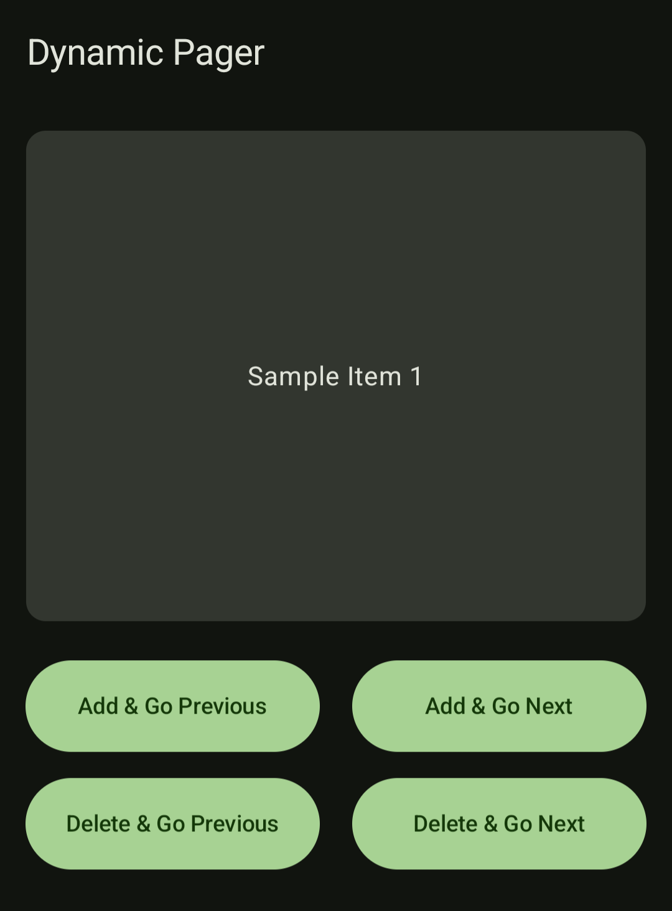

# Dynamic Pager for Android Jetpack Compose
An open-source library extending [Jetpack Compose’s Pager](https://developer.android.com/develop/ui/compose/layouts/pager), designed to support **dynamic adding and removing of pages**.

## Features:
- **Add Pages Dynamically**:
  - Add a page as the next page.
  - Add a page as the previous page (useful for restoring a deleted page)
- **Remove Pages Dynamically**:
  - Remove a page and navigate to the next page.
  - Remove a page and navigate to the previous page (useful for undoing a newly added page).

<p align="center">
  
</p> 


I couldn’t find an existing component that supports dynamic page addition and removal, so I created this library. If you’re aware of an alternative solution, please let me know.

## Getting Started
Copy the `dynamic-pager` module into your project, or copy these files directly from [here](/dynamic-pager/src/main/java/pl/gocards/dynamic_pager). If the project reaches 100 stars, I may publish it to the public Maven repository.

### Example Usage
The code comes from a sample application that you can find [here](/sample-app/src/main/java/pl/gocards/dynamic_pager/sample_app/MainActivity.kt).

```kotlin
// 1. Initialize a DynamicPagerViewModel or extend it to include your custom features.
val viewModel: DynamicPagerViewModel<SampleItem> by viewModels()
...

setContent {
  // 2. Wrap your Pager with DynamicPagerStateBinder to manage Pager state seamlessly.
  DynamicPagerStateBinder(pagerMediator) { pagerState ->
    // 3. Use any Jetpack Compose Pager (e.g., HorizontalPager) as usual.
    HorizontalPager(
      state = pagerState,
      // Disable user scrolling while the page is being updated through ViewModel methods.
      userScrollEnabled = pagerMediator.scrollByUserEnabled.value
    ) { page ->
      PagerCard { Text(text = item.text)}
    }
  }
}
```

Example of ViewModel and Composable View integration:
```kotlin
onClickAddGoPrevious = { page ->
  viewModel.insertPageBefore(
    page,
    SampleItem("Previous Item ${++nextId}")
  )
},
onClickAddGoNext = { page ->
  viewModel.insertPageAfter(
    page,
    SampleItem("Next Item ${++nextId}")
  )
},
onClickDeleteGoPrevious = { page, item ->
  viewModel.deleteAndSlideToPrevious(page, item)
},
onClickDeleteGoNext = { page, item ->
  viewModel.deleteAndSlideToNext(page, item)
}
```

## Real-World Usage
- [GoCards](https://github.com/GoCardsEdu/GoCards) features a complex slider that supports various page types, including View, Edit, and New, and manages items using Room/SQLite.

Let me know if you would like to share your project.

## License
The library is licensed under the [MIT License](LICENSE). Free to use in personal and commercial projects.